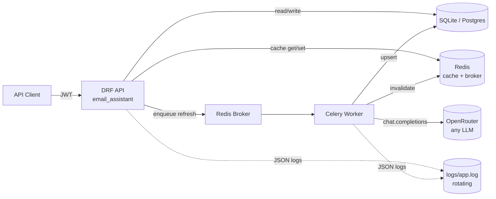

# Email Context & Summarization System

Backend for the Ascend "Email Context" case study. A unified per-thread "source of truth" for CPA-firm accountants emailing the same clients — emails are pulled (mocked) from a provider, summarized with an LLM, encrypted at rest, and exposed through a JWT-gated REST API.

---

## 60-second quick start

```bash
# 1. Python deps
python -m venv venv && source venv/Scripts/activate    # on Windows; use venv/bin/activate elsewhere
pip install -r requirements.txt

# 2. Config
cp .env.example .env
# Edit .env:
#   OPENROUTER_API_KEY=<your key>            # get a free one at openrouter.ai
#   SALT_KEYS=<any high-entropy string>      # encryption salt; dev has a fallback
# REDIS_URL defaults to redis://127.0.0.1:6379 — start Redis any way you like
# (native install, WSL `redis-server`, Memurai on Windows, or hosted free tier).

# 3. DB + seed
python manage.py migrate
python manage.py seed_data        # 4 firms, 26 users, 60 clients, 100 threads, 800+ messages

# 4. Run (two terminals)
python manage.py runserver        # terminal A: API on :8000
celery -A email_assistant worker -l info   # terminal B: refresh worker
```

> **Windows note:** Celery's default `prefork` pool relies on POSIX semaphore
> primitives that don't work on Windows (you'll see `PermissionError: [WinError 5]`
> from `billiard.synchronize._semlock`). Run with `--pool=threads` (recommended —
> our refresh task is I/O-bound on the LLM HTTP call) or `--pool=solo`:
>
> ```powershell
> celery -A email_assistant worker -l info --pool=threads --concurrency=4
> ```
>
> No flag needed on Linux/macOS.

Then open **<http://localhost:8000/api/docs/>** for the full Swagger UI.

---

## End-to-end demo (curl)

The `seed_data` command prints credentials and sample thread IDs at the end of its output. All seeded users share the password `Passw0rd!`.

```bash
# Login as a firm admin → grab access token
TOKEN=$(curl -s -X POST http://localhost:8000/api/auth/token/ \
  -H 'Content-Type: application/json' \
  -d '{"email":"firm1_admin0@example.com","password":"Passw0rd!"}' \
  | python -c "import sys,json; print(json.load(sys.stdin)['access'])")

# List clients in my firm
curl -s -H "Authorization: Bearer $TOKEN" http://localhost:8000/api/clients/

# List threads for a client (CLIENT_ID from the previous response)
curl -s -H "Authorization: Bearer $TOKEN" \
  http://localhost:8000/api/clients/<CLIENT_ID>/threads/

# Get a summary → 404 with refresh_url (summary not generated yet)
curl -s -H "Authorization: Bearer $TOKEN" \
  http://localhost:8000/api/threads/<THREAD_ID>/summary/

# Trigger an async refresh (202 + task_id)
TASK=$(curl -s -X POST -H "Authorization: Bearer $TOKEN" \
  http://localhost:8000/api/threads/<THREAD_ID>/summary/refresh/ \
  | python -c "import sys,json; print(json.load(sys.stdin)['task_id'])")

# Poll task status
curl -s -H "Authorization: Bearer $TOKEN" http://localhost:8000/api/tasks/$TASK/

# Get the summary (cached, decrypted on read)
curl -s -H "Authorization: Bearer $TOKEN" \
  http://localhost:8000/api/threads/<THREAD_ID>/summary/

# Reports
curl -s -H "Authorization: Bearer $TOKEN" \
  "http://localhost:8000/api/reports/firm/?since=2026-01-01"

# Tail structured JSON logs in parallel
tail -f logs/app.log
```

---

## Architecture



**Apps (under `apps/`):**
- `accounts` — `Firm`, `Accountant` (custom user model), JWT auth, custom token claims.
- `core` — `RequestIdMiddleware`, contextvar-aware JSON logging, permissions (`IsInSameFirm`, `IsFirmAdmin`, `IsSuperuser`), `@log_action` decorator, healthcheck.
- `clients` — `Client` model + read endpoints.
- `emails` — `EmailThread` + `EmailMessage` with encrypted subject/body, mock provider service (swappable for a real Microsoft Graph adapter).
- `summaries` — `EmailSummary` with `EncryptedJSONField` payload, Pydantic-validated LLM output, Celery refresh task with Redis SETNX lock, cache invalidation.
- `reports` — firm-admin and superuser aggregate endpoints, date-filtered + paginated.

---

## Where to look first

| File | Why |
|---|---|
| `apps/summaries/services/summarizer.py` | Heart of the system. Orchestrates LLM → Pydantic → encrypted upsert. |
| `apps/summaries/services/llm_client.py` | OpenRouter via the OpenAI-compatible SDK; swap models with `LLM_MODEL` env. |
| `apps/summaries/tasks.py` | Celery refresh task + Redis SETNX lock + cache invalidation. |
| `apps/summaries/views.py` | Strict-404 GET + 202 refresh + task polling. Cache wraps reads. |
| `apps/core/permissions.py` | `IsInSameFirm` / `IsFirmAdmin` / `IsSuperuser` — the AuthZ boundary. |
| `apps/core/logging.py` | Contextvar plumbing + `@log_action` + rotating JSON logfile. |
| `apps/accounts/management/commands/seed_data.py` | Idempotent seed; populates firms/users/clients/threads. |
| `SCHEMA.md` | ER diagram + denormalization rationale + encryption scope. |

---

## Design decisions & trade-offs

### Encryption at rest
- `EncryptedTextField` / `EncryptedCharField` / `EncryptedJSONField` from [`django-fernet-encrypted-fields`](https://github.com/jazzband/django-fernet-encrypted-fields). Library derives a Fernet key from `SECRET_KEY` + `SALT_KEY` via PBKDF2-HMAC-SHA256.
- Encrypted columns: `EmailThread.encrypted_subject`, `EmailMessage.encrypted_body`, `EmailSummary.encrypted_payload`.
- Left cleartext intentionally: `sender_email`, `recipients` — needed for actor extraction, AuthZ filtering, and admin reports. Protected by AuthZ + transport + disk encryption.
- **Trade-off**: random IV makes the ciphertext non-deterministic → no `LIKE` / FTS search on subject/body. Acceptable for the current scope; flagged for future deterministic-encryption work.

### AuthZ
- **Firm-wide visibility**: any accountant in a firm can read any client/thread/summary in that firm. The seed schema *had* an `AccountantClient` join table; we dropped it after spec clarification.
- Enforced in middleware + permission classes + repository layer (defense in depth). Superuser bypasses everywhere.
- `firm_id` is denormalized on `EmailSummary`, `EmailMessage`, `EmailThread` → AuthZ filters are single-table, single-index. Same denormalization powers per-firm reports.

### Summary read semantics
- `GET /api/threads/{id}/summary/` is **strictly read-only**: returns the cached/persisted summary or **404 with a `refresh_url`** if not generated. Keeps GETs idempotent and fast (no 3–10s LLM call inside a read, no concurrent-miss thundering herd).
- Generation is explicit: `POST .../refresh/` enqueues a Celery task and returns `202 + task_id`. Client polls `GET /api/tasks/{id}/`.

### Caching & invalidation
- Decrypted summary cached in Redis under `summary:{thread_id}`, TTL 1h.
- Refresh task invalidates `summary:{thread_id}` and per-firm report keys on success.
- Concurrent refreshes deduplicated via Redis SETNX lock `summary_lock:{thread_id}` (TTL 120s).
- DRF `summary_refresh` throttle scope at 10/min/firm to keep LLM cost bounded.

### Staleness tracking
- `EmailSummary.up_to_message_at` snapshots `max(messages.sent_at)` at refresh time.
- `SummaryReadSerializer.is_stale` computes `latest_message_sent_at > up_to_message_at` on read — surfaces "new emails since this summary" to the API consumer without auto-regenerating.

### LLM provider
- **OpenRouter via the official `openai` SDK** (`base_url=https://openrouter.ai/api/v1`). Swap underlying models (Gemini, Claude, GPT…) with one env var (`LLM_MODEL`).
- Default model `google/gemini-2.0-flash-001` (cheap + fast). `response_format={"type": "json_object"}` + Pydantic post-validation keeps the boundary honest.
- `tenacity` exponential-backoff retries on `APITimeoutError`, `APIConnectionError`, `RateLimitError`.
- **Privacy rule**: LLM logs only sizes + duration + retry count — **never raw email body**.

### Logging
- Console + rotating JSON logfile at `logs/app.log` (10 MB × 5 backups).
- Contextvars (`request_id`, `user_id`, `firm_id`) propagated through middleware *and* Celery `task_prerun/postrun` signals → a request_id initiated in a view follows the refresh task into the worker.
- `@log_action("summary.refresh")` decorator emits one INFO log on success with `duration_ms`, `logger.exception` on failure.

### Tests
- Django built-in test runner (no pytest dep).
- `factory_boy` for fixtures, `CELERY_TASK_ALWAYS_EAGER=True` in test settings, in-memory cache backend.
- Coverage: encryption round-trip + ciphertext-on-disk assertion, Pydantic accepts/rejects, summarizer with mocked LLM (upsert + `up_to_message_at` + idempotency), cross-firm AuthZ denial (clients, threads, summary, refresh, reports).

```bash
python manage.py test
```

---

## API surface

| Method | Path | Auth |
|---|---|---|
| `POST` | `/api/auth/token/` | public |
| `POST` | `/api/auth/token/refresh/` | refresh token |
| `GET`  | `/api/auth/me/` | JWT |
| `GET`  | `/api/clients/` | JWT (firm-scoped) |
| `GET`  | `/api/clients/{id}/` | JWT (firm-scoped) |
| `GET`  | `/api/clients/{id}/threads/` | JWT (firm-scoped) |
| `GET`  | `/api/threads/{id}/` | JWT (firm-scoped) |
| `GET`  | `/api/threads/{id}/summary/` | JWT (firm-scoped) |
| `POST` | `/api/threads/{id}/summary/refresh/` | JWT (firm-scoped, throttled) |
| `GET`  | `/api/tasks/{task_id}/` | JWT |
| `GET`  | `/api/reports/firm/` | JWT (admin) |
| `GET`  | `/api/reports/global/` | JWT (superuser) |
| `GET`  | `/api/schema/`, `/api/docs/` | public (OpenAPI + Swagger UI) |
| `GET`  | `/health/` | public |

---

## What I'd do next with another day

- **Real Microsoft Graph provider** — drop-in alongside `MockEmailProvider`. Add an OAuth flow + token store on `Firm`.
- **Incremental summarization** — instead of re-summarizing from scratch on each refresh, prompt the LLM with `<previous summary> + <new messages>` and ask it to extend. Faster + cheaper; needs careful evaluation for accuracy drift (currently flagged in code comments).
- **Materialized views for reports** — if reporting traffic grows, pre-aggregate `firm_id → (summary_count, last_summarized)` on a nightly refresh schedule. Keeps the admin endpoints O(1).
- **Signoz (OpenTelemetry)** — `opentelemetry-instrumentation-django` + `opentelemetry-instrumentation-celery` → OTLP exporter to a local Signoz collector. Adds traces + RED metrics without touching app code. Out of scope here; logfile JSON is the bridge.
- **Deterministic encryption / searchable fields** — if subject/body search becomes a requirement, switch those columns to AES-SIV (deterministic) or maintain a parallel HMAC-hashed token index.
- **Soft-delete + audit log** — `deleted_at` on rows, an `AuditEvent` table for who-did-what.

---

## Intentionally out of scope

- CRUD endpoints for Firm / Client / Accountant (seeded only).
- Multi-firm clients (the spec confirmed one firm per client).
- A frontend.
- Production deployment / infra.
