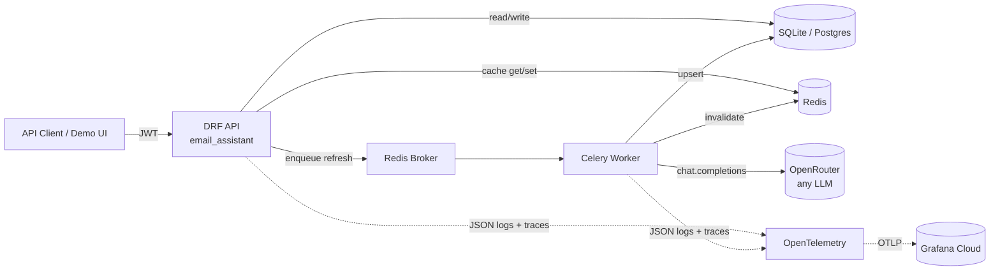

# Email Context & Summarization System

Backend for the Ascend "Email Context" case study. CPA-firm accountants emailing the same client need a unified per-thread "source of truth" instead of replaying each other's questions. This service ingests (mocked) email threads, summarizes them with an LLM, encrypts the result at rest, and exposes everything through a JWT-gated REST API plus a thin demo UI.

**Stack:** Django 5 + DRF, SimpleJWT, Celery + Redis, SQLite (Postgres-ready), `django-fernet-encrypted-fields`, OpenRouter (OpenAI-compatible SDK), Pydantic, OpenTelemetry → Grafana Cloud.

---

## Quick start

> **Prereqs:** Python 3.11+, Redis reachable at `127.0.0.1:6379` (WSL `redis-server`, Memurai on Windows, or any native install), an OpenRouter API key from [openrouter.ai](https://openrouter.ai).

```powershell
# 1. Python venv + deps  (PowerShell — for Git Bash use `source venv/Scripts/activate`)
python -m venv venv
venv\Scripts\Activate.ps1
pip install -r requirements.txt

# 2. Config — fill the three must-set values in .env
Copy-Item .env.example .env
#   DJANGO_SECRET_KEY  - any random string >= 32 bytes:
#                        python -c "import secrets; print(secrets.token_urlsafe(64))"
#   SALT_KEYS          - any high-entropy string, comma-separated for rotation
#   OPENROUTER_API_KEY - your sk-or-v1-... key

# 3. DB + seed
python manage.py migrate
python manage.py seed_data
#   → 4 firms, 26 accountants, 60 clients, 100 threads, ~800 messages
#   → prints sample thread UUIDs to paste into the demo UI

# 4. Run everything (Django + Celery worker) in one command
.\dev.ps1
```

`dev.ps1` spawns the Django server and Celery worker in their own PowerShell windows, after probing Redis. Manual equivalent:

```powershell
# Terminal A — API on :8000
python manage.py runserver

# Terminal B — refresh worker
celery -A email_assistant worker -l info --pool=threads --concurrency=8 -Q email_assistant
```

Then open:

| | URL |
|---|---|
| **Demo UI** | <http://localhost:8000/> — login is prefilled with `firm1_admin0@example.com` / `Passw0rd!` |
| **Swagger / OpenAPI** | <http://localhost:8000/api/docs/> |
| **Healthcheck** | <http://localhost:8000/health/> |

### Two flags that bite

- **`-Q email_assistant`** on the worker is mandatory if another Celery app on your machine also points at this Redis (very common locally). Symptom of forgetting: tasks stay `PENDING` forever even though they're sent.
- **`--pool=threads`** is required on Windows — Celery's default prefork pool relies on POSIX semaphores that Windows lacks (`PermissionError: [WinError 5]`). Our task is I/O-bound on the LLM HTTP call so threads are the right pool anyway. `--concurrency=8` is a fine starting point; the real ceiling is OpenRouter's rate limit, not your CPU.

---

## Architecture



**Apps under `apps/`:**

| App | Owns |
|---|---|
| `core` | `RequestIdMiddleware`, JSON logging w/ contextvars + OTel trace_id, permissions (`IsInSameFirm`, `IsFirmAdmin`, `IsSuperuser`), `@log_action` decorator, OTel setup, baggage helper, healthcheck. |
| `accounts` | `Firm`, `Accountant` (custom user, UUID PK, email login, role enum), JWT auth w/ custom token claims (`firm_id`, `role`), `seed_data` command. |
| `clients` | `Client` model + firm-scoped read endpoints. |
| `emails` | `EmailThread` + `EmailMessage` with **encrypted subject/body**, mock provider service (swappable for Microsoft Graph). |
| `summaries` | `EmailSummary` with `EncryptedJSONField` payload, Pydantic-validated LLM output, Celery refresh task, two-layer concurrent-refresh dedup, post-commit cache invalidation. |
| `reports` | Firm-admin and superuser aggregate endpoints, drillable into the underlying summaries, date-filtered + paginated. |

**Demo UI** at `/` — single-page vanilla JS + Tailwind CDN. Three screens: Login, Thread (with async refresh + polling), Reports (drillable). Not part of the backend deliverable; exists so reviewers can click through the flows instead of copying UUIDs into curl. See `templates/index.html` + `static/app.js`.

See `SCHEMA.md` for the ER diagram and denormalization rationale.

---

## API surface

| Method | Path | Auth | Notes |
|---|---|---|---|
| `POST` | `/api/auth/token/` | public | JWT obtain — custom claims `firm_id`, `role` |
| `POST` | `/api/auth/token/refresh/` | refresh token | rotation enabled |
| `GET` | `/api/auth/me/` | JWT | current accountant |
| `GET` | `/api/clients/` | JWT | firm-scoped, `?search=` |
| `GET` | `/api/clients/{id}/` | JWT | firm-scoped |
| `GET` | `/api/clients/{id}/threads/` | JWT | firm-scoped, paginated |
| `GET` | `/api/threads/sample/` | JWT | small pick-list for the demo UI (firm-scoped; superuser sees cross-firm) |
| `GET` | `/api/threads/{id}/` | JWT | thread + ordered messages |
| `GET` | `/api/threads/{id}/summary/` | JWT | **404 + `refresh_url`** on miss; `is_stale` flag if new messages since `up_to_message_at` |
| `POST` | `/api/threads/{id}/summary/refresh/` | JWT, throttled | `202 + {task_id, status_url, joined}` |
| `GET` | `/api/tasks/{task_id}/` | JWT | `{status, result, error}` |
| `GET` | `/api/reports/firm/` | JWT admin | drillable — each client row carries its underlying summaries; `?since=&until=` |
| `GET` | `/api/reports/global/` | JWT superuser | grouped by firm, drillable, `?since=&until=` |
| `GET` | `/api/schema/`, `/api/docs/` | public | OpenAPI + Swagger UI |
| `GET` | `/health/` | public | liveness |

---

## End-to-end demo (curl)

All seeded users share password `Passw0rd!`. Sample thread UUIDs are printed at the end of `seed_data`.

```bash
# 1. Login → access token
TOKEN=$(curl -s -X POST http://localhost:8000/api/auth/token/ \
  -H 'Content-Type: application/json' \
  -d '{"email":"firm1_admin0@example.com","password":"Passw0rd!"}' \
  | python -c "import sys,json; print(json.load(sys.stdin)['access'])")

# 2. List clients in my firm
curl -s -H "Authorization: Bearer $TOKEN" http://localhost:8000/api/clients/

# 3. Get a summary — expect 404 + refresh_url
curl -s -H "Authorization: Bearer $TOKEN" \
  http://localhost:8000/api/threads/<THREAD_ID>/summary/

# 4. Trigger async refresh → 202 + task_id
TASK=$(curl -s -X POST -H "Authorization: Bearer $TOKEN" \
  http://localhost:8000/api/threads/<THREAD_ID>/summary/refresh/ \
  | python -c "import sys,json; print(json.load(sys.stdin)['task_id'])")

# 5. Poll until SUCCESS
curl -s -H "Authorization: Bearer $TOKEN" http://localhost:8000/api/tasks/$TASK/

# 6. Get the summary again — now 200, decrypted on read
curl -s -H "Authorization: Bearer $TOKEN" \
  http://localhost:8000/api/threads/<THREAD_ID>/summary/

# 7. Reports (admin)
curl -s -H "Authorization: Bearer $TOKEN" \
  "http://localhost:8000/api/reports/firm/?since=2026-01-01"

# 8. Watch structured logs alongside
tail -f logs/app.log
```

---

## Design decisions & trade-offs

### Encryption at rest

- `EncryptedTextField` / `EncryptedCharField` / `EncryptedJSONField` from [`django-fernet-encrypted-fields`](https://github.com/jazzband/django-fernet-encrypted-fields). The library derives a Fernet key from `SECRET_KEY` + `SALT_KEY` via PBKDF2-HMAC-SHA256.
- **Encrypted columns:** `EmailThread.encrypted_subject`, `EmailMessage.encrypted_body`, `EmailSummary.encrypted_payload`.
- **Cleartext on purpose:** `sender_email`, `recipients` — needed for actor extraction, AuthZ filtering, and admin reports. Protected by AuthZ + transport + disk encryption.
- **Trade-off:** random IV makes ciphertext non-deterministic → no `LIKE` / FTS search on subject/body. Acceptable for current scope; deterministic AES-SIV is the future-work path if search becomes a requirement.
- **Gotcha worth knowing:** the library catches `InvalidToken` silently and returns raw ciphertext (`gAAAAA...`) when keys mismatch — no error in logs. If you ever see ciphertext in API responses, either set `SECRET_KEY_FALLBACKS` and add older `SALT_KEYS` entries, or wipe `db.sqlite3` and re-seed.

### AuthZ

- **Firm-wide visibility:** any accountant in a firm reads any client/thread/summary in that firm (per spec clarification). No `AccountantClient` join table.
- **Defense in depth:** permission classes (`IsInSameFirm`, `IsFirmAdmin`, `IsSuperuser`) + queryset filtering in the views + scope checks in repositories. Superuser bypasses all three.
- **Cross-firm = 404, not 403** — avoids leaking existence of resources to outside firms. Same pattern as GitHub's private-repo response.
- **Denormalized `firm_id`** on `EmailSummary`, `EmailMessage`, `EmailThread` — single-table indexed AuthZ filter, no joins. Same denormalization powers per-firm reports cheaply.

### Summary read semantics

- `GET /api/threads/{id}/summary/` is **strictly read-only**: cache hit / DB hit / 404. No LLM call inside a read path.
- 404 response includes a `refresh_url` so the client knows how to generate one.
- Generation is explicit: `POST .../refresh/` enqueues a Celery task, returns `202 + task_id`. Client polls `GET /api/tasks/{id}/`.
- Keeps GETs idempotent and sub-10ms (cache hot path); LLM cost stays bounded.

### Caching & invalidation

- **Decrypted summary cached in Redis** under `summary:v{N}:{thread_id}`, TTL 1h. The `v{N}` version segment lets a serializer-shape change invalidate the cache namespace by bumping `SUMMARY_CACHE_VERSION` in `apps/summaries/services/cache.py` — old payloads orphan and TTL out instead of being served against a new client.
- **Post-commit invalidation** — `SummaryService.refresh` wraps the upsert in `transaction.atomic` and queues the cache delete via `transaction.on_commit`. Closes the write-then-invalidate race: the cache delete only fires once the row is durable, so a concurrent reader can't repopulate from the *old* DB state.
- **Graceful Redis outage** — `IGNORE_EXCEPTIONS=True` on the cache backend. If Redis dies, `cache.get` returns `None` (we fall through to DB), `cache.set` silently no-ops, `django_redis` logs the swallowed exception at WARNING. The read path stays serving correctly. (Note: Celery's broker is also Redis here — async refresh is *not* graceful under a Redis outage.)

### Concurrent refresh handling (two layers of dedup)

When N users hit "Refresh" on the same thread, we collapse them to one LLM call:

1. **API-edge fan-in** — `summary_inflight:{thread_id}` SETNX key (TTL 120s). The view pre-generates a `task_id`, claims the slot, and either enqueues the task (claim won) or returns the existing task_id with `joined: true` (claim lost). N concurrent triggers all poll the same task_id.
2. **Worker-side lock** — `summary_lock:{thread_id}` SETNX inside the task. Catches the rare case where the inflight key was claimed but the worker started a duplicate anyway (TTL race). Returns `{"status": "skipped", "reason": "another_refresh_in_progress"}`. The UI surfaces this as *"Another refresh just completed — showing latest"*.

### Staleness tracking

- `EmailSummary.up_to_message_at` snapshots `max(messages.sent_at)` at refresh time.
- `SummaryReadSerializer.is_stale` computes `latest_message_sent_at > up_to_message_at` on read — surfaces "new emails since this summary" to the API consumer without auto-regenerating.

### LLM provider

- **OpenRouter via the official `openai` SDK** (`base_url=https://openrouter.ai/api/v1`). Swap underlying models with one env var (`LLM_MODEL`).
- Default `google/gemini-2.0-flash-001` (cheap, fast, the brief asked for Gemini). Demo runs `openai/gpt-oss-120b:free` because Gemini needs paid OpenRouter credits — one-line `.env` change away.
- `response_format={"type": "json_object"}` + Pydantic post-validation keeps the model honest.
- `tenacity` exponential backoff on `APITimeoutError`, `APIConnectionError`, `RateLimitError`.
- **Defensive parsing** — `_sanitize_payload` in `llm_client.py` drops obviously-malformed list entries (e.g. actors with `null` name) before Pydantic validation. Schema stays strict; sloppy free-tier output doesn't fail the whole task.
- **Privacy rule** — LLM logs only sizes + duration + retry count, **never raw email body**. The encryption boundary extends to the logfile.

### Logging & observability

- Console + rotating JSON logfile at `logs/app.log` (10 MB × 5 backups).
- Every log record carries `request_id`, `user_id`, `firm_id`, `trace_id`, `span_id`, `action`, `duration_ms` via a `ContextFilter` that reads contextvars + the active OTel span.
- Cross-process propagation: `request_id` / `user_id` / `firm_id` travel from view → Celery worker via **OTel baggage** (auto-carried in task headers by `CeleryInstrumentor`). So worker log lines carry the same identifiers as the request that triggered them.
- `@log_action("summary.refresh")` decorator wraps service methods, emits one INFO on success with `duration_ms`, `logger.exception` on failure.

See the "Observability" section below for shipping these to Grafana Cloud.

---

## Tests

Django built-in test runner, no pytest dep. `factory_boy` fixtures, `CELERY_TASK_ALWAYS_EAGER=True` in test settings, LocMemCache backend.

```bash
python manage.py test
```

**26 tests.** Coverage matrix:

- Encryption round-trip + ciphertext-on-disk assertion (4)
- Pydantic schema accept/reject (5)
- Summarizer service with mocked LLM — upsert, `up_to_message_at`, idempotency (4)
- Refresh-fan-in dedup — first POST claims, concurrent POST joins existing task_id (2)
- Cross-firm AuthZ denial across clients, threads, summary, refresh, reports (11)

---

## Load testing (Locust)

`locustfile.py` ships four user classes. Pass class names as **positional args** to pick a scenario; omit for the weighted mix.

```bash
# Web UI at http://localhost:8089
locust -f locustfile.py --host http://localhost:8000

# Headless: realistic read-heavy mix
locust -f locustfile.py --host http://localhost:8000 \
    --headless -u 20 -r 10 -t 30s ReaderUser

# Fan-in proof — many users hammer ONE thread
locust -f locustfile.py --host http://localhost:8000 \
    --headless -u 30 -r 30 -t 15s DedupHammerUser

# Reports under load
locust -f locustfile.py --host http://localhost:8000 \
    AdminReportUser SuperReportUser
```

### Measured results (local box, free-tier LLM model)

**ReaderUser — 95/5 read/write mix, 20 users × 30 s, 469 requests, 0 failures**

| Endpoint | requests | p50 | p99 | what it tells us |
|---|---|---|---|---|
| `GET /api/threads/{id}/summary/` | 268 | **9 ms** | 45 ms | Redis cache hits — the goal |
| `GET /api/threads/{id}/` | 134 | **10 ms** | 44 ms | DB query + decrypt; cheap |
| `POST .../summary/refresh/` | 27 | 19 ms | 120 ms | View-edge response only (real work async) |
| `POST /api/auth/token/` | 20 | 2500 ms | 2600 ms | PBKDF2 password hashing — one-time per user, ignore |

→ ~16 req/s aggregate, cache hot path well under 50 ms p99.

**DedupHammerUser — 30 users hammering one thread, 15 s, 1587 POSTs, 0 failures**

| Metric | Value | Note |
|---|---|---|
| Sustained throughput | **110 req/s** | All to `/summary/refresh/` |
| p50 / p99 latency | 77 ms / 550 ms | View-edge: cache.add + Celery enqueue |
| Failures | 0 | 202 (passed) and 429 (rate-limited) both counted as success |
| Throttle budget | ~75 / 15 s passed | 30 users × 10/min DRF throttle |
| Actual LLM calls run | **1–2** | Visible in the Celery worker log |

→ The fan-in story is real: 1587 POSTs land on one LLM call. Even without throttle, the inflight key collapses concurrent triggers at the API edge.

---

## Observability (OpenTelemetry → Grafana Cloud / Signoz / any OTLP backend)

Telemetry is wired in but **off by default** — flip it on with one env var, no code change.

**What ships when enabled:**

- **Traces** for every HTTP request and every Celery task. Trace context propagates through task headers so one trace spans `view → cache → enqueue → worker → LLM call → DB write`.
- **Logs** exported via OTLP, automatically tagged with the active `trace_id` + `span_id`. In Grafana you can click a trace → see its log lines, click a log → see its trace.
- **Auto-instrumented:** Django (DRF views), Celery (tasks + signals), Redis (cache + broker), httpx (the OpenAI SDK's outbound calls), sqlite3 (DB queries — swap to psycopg2 in prod).
- **On-disk logs unchanged** — `logs/app.log` lines now also carry `trace_id` / `span_id`, so grep correlates with the UI.

**Turn it on (`.env` additions, get values from Grafana Cloud → Connections → Add → OpenTelemetry):**

```env
OTEL_ENABLED=true
OTEL_SERVICE_NAME=email_assistant
OTEL_EXPORTER_OTLP_ENDPOINT=https://otlp-gateway-prod-<region>.grafana.net/otlp
OTEL_EXPORTER_OTLP_PROTOCOL=http/protobuf
OTEL_EXPORTER_OTLP_HEADERS=Authorization=Basic%20<base64(instance_id:api_token)>
```

Restart server + worker (same commands as before, no wrapper). Wiring is in `apps/core/telemetry.py`, called from `CoreConfig.ready()` so it fires in both web and worker processes. With `OTEL_ENABLED=false`, `setup_telemetry()` returns immediately — no exporters, no instrumentation, no overhead.

---

## Where to look first

| File | Why |
|---|---|
| `apps/summaries/services/summarizer.py` | Orchestrator — LLM → Pydantic → encrypted upsert → post-commit cache invalidate. |
| `apps/summaries/services/prompts.py` | System prompt + user prompt builder. Iterate on prompt copy here. |
| `apps/summaries/services/llm_client.py` | OpenRouter via OpenAI-compatible SDK + tenacity retry + `_sanitize_payload`. |
| `apps/summaries/services/cache.py` | Cache keys, locks, inflight, versioning. |
| `apps/summaries/views.py` | Strict-404 GET, 202 refresh with fan-in dedup, task polling. |
| `apps/summaries/tasks.py` | Celery refresh task + lock/inflight cleanup. |
| `apps/core/baggage.py` | OTel baggage helper for cross-process request_id/user_id/firm_id propagation. |
| `apps/core/telemetry.py` | OpenTelemetry setup — traces + logs, gated by `OTEL_ENABLED`. |
| `apps/core/permissions.py` | `IsInSameFirm` / `IsFirmAdmin` / `IsSuperuser` — the AuthZ boundary. |
| `apps/accounts/management/commands/seed_data.py` | Idempotent seed; populates firms/users/clients/threads with realistic CPA correspondence. |
| `SCHEMA.md` | ER diagram + denormalization rationale + encryption scope. |

---

## Deployment notes (not wired here, but worth doing)

- **Redis eviction policy** — set `maxmemory-policy allkeys-lru`. Default `noeviction` makes Redis hard-error on writes when memory is full. With LRU, cold summary entries get evicted first; the short-TTL locks/inflight keys (120 s) survive.
- **Redis persistence** — for our use case the cache can be lost without correctness impact (DB is source of truth), so `appendonly no` is fine — the next reads simply repopulate from DB.
- **Cache vs broker split** — production should put Celery's broker on a separate Redis instance (or RabbitMQ) so a cache outage doesn't take down async work too.
- **Postgres swap** — set `DATABASE_URL=postgres://...` in `.env`. Replace `opentelemetry-instrumentation-sqlite3` with `opentelemetry-instrumentation-psycopg2` for DB-query spans.

---

## What I'd do next with another day

- **Real Microsoft Graph provider** — drop-in alongside `MockEmailProvider` (the `EmailProvider` Protocol already exists in `apps/emails/services/provider_base.py`). Add an OAuth flow + token store on `Firm`.
- **Incremental summarization** — instead of re-summarizing from scratch each refresh, prompt with `<previous summary> + <new messages>` and ask the LLM to extend. Faster + cheaper; needs evaluation for accuracy drift.
- **Materialized views for reports** — at 100k+ summaries the in-Python grouping starts to hurt. Pre-aggregate `firm_id → (summary_count, last_summarized)` on a nightly schedule, keep admin endpoints O(1).
- **Deterministic encryption / searchable fields** — AES-SIV on subject/body, or a parallel HMAC-hashed token index, if search becomes a requirement.
- **Soft-delete + audit log** — `deleted_at` on rows, an `AuditEvent` table for who-did-what.

---

## Intentionally out of scope

- CRUD endpoints for Firm / Client / Accountant — populated by the seed command only.
- Multi-firm clients (spec confirmed one firm per client).
- A production frontend. The bundled demo UI at `/` exists to make flows clickable; it deliberately skips client/thread browsing in favour of pasting UUIDs from `seed_data` or using the sample-thread chips.
- Production deployment / infra.
