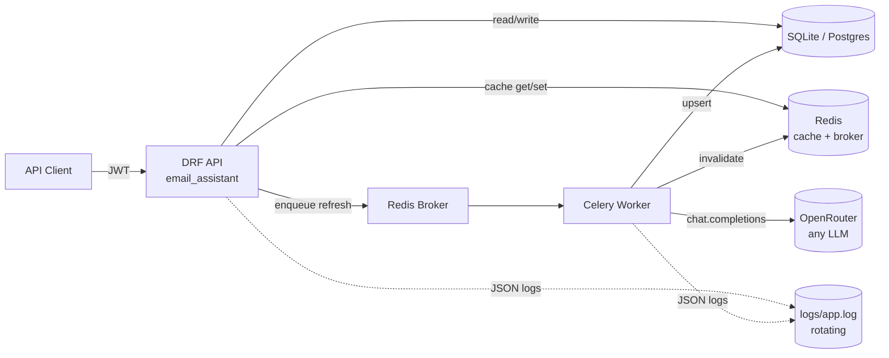

# Email Context & Summarization System

Backend for the Ascend "Email Context" case study. A unified per-thread "source of truth" for CPA-firm accountants emailing the same clients — emails are pulled (mocked) from a provider, summarized with an LLM, encrypted at rest, and exposed through a JWT-gated REST API.

---

## 60-second quick start

```bash
# 1. Python deps
python -m venv venv && source venv/Scripts/activate    # on Windows; use venv/bin/activate elsewhere
pip install -r requirements.txt

# 2. Config
cp .env.example .env
# Edit .env:
#   OPENROUTER_API_KEY=<your key>            # get a free one at openrouter.ai
#   SALT_KEYS=<any high-entropy string>      # encryption salt; dev has a fallback
# REDIS_URL defaults to redis://127.0.0.1:6379 — start Redis any way you like
# (native install, WSL `redis-server`, Memurai on Windows, or hosted free tier).

# 3. DB + seed
python manage.py migrate
python manage.py seed_data        # 4 firms, 26 users, 60 clients, 100 threads, 800+ messages

# 4. Run — one command spawns both Django and the Celery worker
.\dev.ps1            # Windows (PowerShell) — opens a window each for runserver + worker

# Or manually:
python manage.py runserver                                  # terminal A: API on :8000
celery -A email_assistant worker -l info -Q email_assistant # terminal B: refresh worker
```

> **`-Q email_assistant` matters.** The app declares a dedicated queue
> (`CELERY_TASK_DEFAULT_QUEUE = "email_assistant"`) so its tasks aren't silently
> consumed by other Celery apps sharing the same Redis broker on your machine —
> a common gotcha during local development when several Django projects all
> point at `redis://127.0.0.1:6379/0`. Symptom of forgetting: tasks stay
> `PENDING` forever even though Redis received them.
>
> **Windows note:** Celery's default `prefork` pool relies on POSIX semaphore
> primitives that don't work on Windows (you'll see `PermissionError: [WinError 5]`
> from `billiard.synchronize._semlock`). Run with `--pool=threads` (recommended —
> our refresh task is I/O-bound on the LLM HTTP call) or `--pool=solo`:
>
> ```powershell
> celery -A email_assistant worker -l info --pool=threads --concurrency=8 -Q email_assistant
> ```
>
> `--concurrency=8` is a reasonable starting point for I/O-bound work on a modern
> 8-core box; the real ceiling is OpenRouter's rate limit and our 10/min/firm
> DRF throttle, not your CPU. No `--pool` flag needed on Linux/macOS.

Then open **<http://localhost:8000/>** for the demo UI (or **<http://localhost:8000/api/docs/>** for the full Swagger UI).

The seed command prints sample thread UUIDs at the end of its output — copy one to paste into the UI's Thread input.

---

## End-to-end demo (curl)

The `seed_data` command prints credentials and sample thread IDs at the end of its output. All seeded users share the password `Passw0rd!`.

```bash
# Login as a firm admin → grab access token
TOKEN=$(curl -s -X POST http://localhost:8000/api/auth/token/ \
  -H 'Content-Type: application/json' \
  -d '{"email":"firm1_admin0@example.com","password":"Passw0rd!"}' \
  | python -c "import sys,json; print(json.load(sys.stdin)['access'])")

# List clients in my firm
curl -s -H "Authorization: Bearer $TOKEN" http://localhost:8000/api/clients/

# List threads for a client (CLIENT_ID from the previous response)
curl -s -H "Authorization: Bearer $TOKEN" \
  http://localhost:8000/api/clients/<CLIENT_ID>/threads/

# Get a summary → 404 with refresh_url (summary not generated yet)
curl -s -H "Authorization: Bearer $TOKEN" \
  http://localhost:8000/api/threads/<THREAD_ID>/summary/

# Trigger an async refresh (202 + task_id)
TASK=$(curl -s -X POST -H "Authorization: Bearer $TOKEN" \
  http://localhost:8000/api/threads/<THREAD_ID>/summary/refresh/ \
  | python -c "import sys,json; print(json.load(sys.stdin)['task_id'])")

# Poll task status
curl -s -H "Authorization: Bearer $TOKEN" http://localhost:8000/api/tasks/$TASK/

# Get the summary (cached, decrypted on read)
curl -s -H "Authorization: Bearer $TOKEN" \
  http://localhost:8000/api/threads/<THREAD_ID>/summary/

# Reports
curl -s -H "Authorization: Bearer $TOKEN" \
  "http://localhost:8000/api/reports/firm/?since=2026-01-01"

# Tail structured JSON logs in parallel
tail -f logs/app.log
```

---

## Architecture



**Demo UI** (`templates/index.html` + `static/app.js`): a single-page vanilla-JS app served by Django at `/`. Three screens — Login, Thread detail (with async refresh + polling), and admin/superuser Reports. Reports are **drillable**: each aggregate row (client for admins; firm for superusers) expands inline to the underlying summaries, and clicking any summary jumps straight to the Thread screen with that UUID loaded. Tailwind via CDN, no build step. Exists to make the backend's interesting flows clickable; not part of the case-study deliverable scope.

**Apps (under `apps/`):**
- `accounts` — `Firm`, `Accountant` (custom user model), JWT auth, custom token claims.
- `core` — `RequestIdMiddleware`, contextvar-aware JSON logging, permissions (`IsInSameFirm`, `IsFirmAdmin`, `IsSuperuser`), `@log_action` decorator, healthcheck.
- `clients` — `Client` model + read endpoints.
- `emails` — `EmailThread` + `EmailMessage` with encrypted subject/body, mock provider service (swappable for a real Microsoft Graph adapter).
- `summaries` — `EmailSummary` with `EncryptedJSONField` payload, Pydantic-validated LLM output, Celery refresh task with Redis SETNX lock, cache invalidation.
- `reports` — firm-admin and superuser aggregate endpoints, date-filtered + paginated.

---

## Where to look first

| File | Why |
|---|---|
| `apps/summaries/services/summarizer.py` | Heart of the system. Orchestrates LLM → Pydantic → encrypted upsert. |
| `apps/summaries/services/prompts.py` | System prompt + user-prompt builder. Iterate on prompt copy here without touching transport/parsing code. |
| `apps/summaries/services/llm_client.py` | OpenRouter via the OpenAI-compatible SDK; swap models with `LLM_MODEL` env. |
| `apps/summaries/tasks.py` | Celery refresh task + Redis SETNX lock + cache invalidation. |
| `apps/summaries/views.py` | Strict-404 GET + 202 refresh + task polling. Cache wraps reads. |
| `apps/core/permissions.py` | `IsInSameFirm` / `IsFirmAdmin` / `IsSuperuser` — the AuthZ boundary. |
| `apps/core/logging.py` | Contextvar plumbing + `@log_action` + rotating JSON logfile. |
| `apps/accounts/management/commands/seed_data.py` | Idempotent seed; populates firms/users/clients/threads. |
| `SCHEMA.md` | ER diagram + denormalization rationale + encryption scope. |

---

## Design decisions & trade-offs

### Encryption at rest
- `EncryptedTextField` / `EncryptedCharField` / `EncryptedJSONField` from [`django-fernet-encrypted-fields`](https://github.com/jazzband/django-fernet-encrypted-fields). Library derives a Fernet key from `SECRET_KEY` + `SALT_KEY` via PBKDF2-HMAC-SHA256.
- Encrypted columns: `EmailThread.encrypted_subject`, `EmailMessage.encrypted_body`, `EmailSummary.encrypted_payload`.
- Left cleartext intentionally: `sender_email`, `recipients` — needed for actor extraction, AuthZ filtering, and admin reports. Protected by AuthZ + transport + disk encryption.
- **Trade-off**: random IV makes the ciphertext non-deterministic → no `LIKE` / FTS search on subject/body. Acceptable for the current scope; flagged for future deterministic-encryption work.
- **Gotcha to know.** The library catches `InvalidToken` silently in `to_python` and returns the *raw ciphertext* instead of raising. That means if `SECRET_KEY` or `SALT_KEYS` change after data is written, the API will return Fernet ciphertext (`gAAAAA...`) where plaintext should be — with no error in the logs. If you ever see that, either rotate via `SECRET_KEY_FALLBACKS` + multi-entry `SALT_KEYS`, or wipe `db.sqlite3` and re-seed.

### AuthZ
- **Firm-wide visibility**: any accountant in a firm can read any client/thread/summary in that firm. The seed schema *had* an `AccountantClient` join table; we dropped it after spec clarification.
- Enforced in middleware + permission classes + repository layer (defense in depth). Superuser bypasses everywhere.
- `firm_id` is denormalized on `EmailSummary`, `EmailMessage`, `EmailThread` → AuthZ filters are single-table, single-index. Same denormalization powers per-firm reports.

### Summary read semantics
- `GET /api/threads/{id}/summary/` is **strictly read-only**: returns the cached/persisted summary or **404 with a `refresh_url`** if not generated. Keeps GETs idempotent and fast (no 3–10s LLM call inside a read, no concurrent-miss thundering herd).
- Generation is explicit: `POST .../refresh/` enqueues a Celery task and returns `202 + task_id`. Client polls `GET /api/tasks/{id}/`.

### Caching & invalidation
- Decrypted summary cached in Redis under `summary:v{N}:{thread_id}`, TTL 1h. The `v{N}` version segment lets a serializer-shape change invalidate the cache namespace by bumping `SUMMARY_CACHE_VERSION` in `apps/summaries/services/cache.py` — old payloads orphan and TTL out instead of being served against a new client.
- **Post-commit invalidation**: `SummaryService.refresh` wraps the DB upsert in `transaction.atomic` and queues `invalidate_summary` via `transaction.on_commit` (`apps/summaries/services/summarizer.py`). Closes the write-then-invalidate race — the cache delete only fires once the new row is durable, so concurrent readers can't repopulate from the old DB state.
- **Graceful Redis outage**: `CACHES["default"]["OPTIONS"]["IGNORE_EXCEPTIONS"] = True`. If Redis is unreachable, cache reads return `None` (we fall through to the DB), cache writes drop silently, and `django_redis` logs the swallowed exception at WARNING — the app stays up.
- DRF `summary_refresh` throttle scope at 10/min/firm to keep LLM cost bounded.

### Concurrent refresh handling (two layers of dedup)
- **API-edge fan-in** (`summary_inflight:{thread_id}` in Redis, TTL 120s): `POST /api/threads/{id}/summary/refresh/` pre-generates a `task_id`, then `cache.add(inflight_key, task_id)`-claims it atomically. Concurrent triggers that lose the claim read the existing `task_id` and return `202 + {task_id, joined: true}` — so N simultaneous "Refresh" clicks all converge on **one task** that the UI polls. No fan-out at all to the worker layer. Cleared by the task's `finally` block.
- **Worker-side lock** (`summary_lock:{thread_id}`, TTL 120s, same SETNX pattern): defensive — catches the rare case where the inflight key was claimed but the task slipped through dedup (e.g., inflight TTL race). Returns `{"status": "skipped", "reason": "another_refresh_in_progress"}` from the task, which the UI surfaces as *"Another refresh just completed — showing latest."* instead of falsely claiming "Summary refreshed."

### Staleness tracking
- `EmailSummary.up_to_message_at` snapshots `max(messages.sent_at)` at refresh time.
- `SummaryReadSerializer.is_stale` computes `latest_message_sent_at > up_to_message_at` on read — surfaces "new emails since this summary" to the API consumer without auto-regenerating.

### LLM provider
- **OpenRouter via the official `openai` SDK** (`base_url=https://openrouter.ai/api/v1`). Swap underlying models (Gemini, Claude, GPT…) with one env var (`LLM_MODEL`).
- Default model `google/gemini-2.0-flash-001` (cheap + fast). `response_format={"type": "json_object"}` + Pydantic post-validation keeps the boundary honest.
- `tenacity` exponential-backoff retries on `APITimeoutError`, `APIConnectionError`, `RateLimitError`.
- **Defensive parsing.** Free-tier models occasionally emit `{"name": null}` actor entries or empty-string action items. `_sanitize_payload` in `llm_client.py` drops obviously-malformed list entries *before* Pydantic validation — schema hard fields stay strict; the rest fails closed.
- **Privacy rule**: LLM logs only sizes + duration + retry count — **never raw email body**.

### Logging
- Console + rotating JSON logfile at `logs/app.log` (10 MB × 5 backups).
- Contextvars (`request_id`, `user_id`, `firm_id`) propagated through middleware *and* Celery `task_prerun/postrun` signals → a request_id initiated in a view follows the refresh task into the worker.
- `@log_action("summary.refresh")` decorator emits one INFO log on success with `duration_ms`, `logger.exception` on failure.

### Tests
- Django built-in test runner (no pytest dep).
- `factory_boy` for fixtures, `CELERY_TASK_ALWAYS_EAGER=True` in test settings, in-memory cache backend.
- Coverage: encryption round-trip + ciphertext-on-disk assertion, Pydantic accepts/rejects, summarizer with mocked LLM (upsert + `up_to_message_at` + idempotency), cross-firm AuthZ denial (clients, threads, summary, refresh, reports).

```bash
python manage.py test
```

---

## API surface

| Method | Path | Auth |
|---|---|---|
| `POST` | `/api/auth/token/` | public |
| `POST` | `/api/auth/token/refresh/` | refresh token |
| `GET`  | `/api/auth/me/` | JWT |
| `GET`  | `/api/clients/` | JWT (firm-scoped) |
| `GET`  | `/api/clients/{id}/` | JWT (firm-scoped) |
| `GET`  | `/api/clients/{id}/threads/` | JWT (firm-scoped) |
| `GET`  | `/api/threads/sample/` | JWT — small pick-list for the demo UI (firm-scoped; superuser sees cross-firm) |
| `GET`  | `/api/threads/{id}/` | JWT (firm-scoped) |
| `GET`  | `/api/threads/{id}/summary/` | JWT (firm-scoped) |
| `POST` | `/api/threads/{id}/summary/refresh/` | JWT (firm-scoped, throttled) |
| `GET`  | `/api/tasks/{task_id}/` | JWT |
| `GET`  | `/api/reports/firm/` | JWT (admin) |
| `GET`  | `/api/reports/global/` | JWT (superuser) |
| `GET`  | `/api/schema/`, `/api/docs/` | public (OpenAPI + Swagger UI) |
| `GET`  | `/health/` | public |

---

## What I'd do next with another day

- **Real Microsoft Graph provider** — drop-in alongside `MockEmailProvider`. Add an OAuth flow + token store on `Firm`.
- **Incremental summarization** — instead of re-summarizing from scratch on each refresh, prompt the LLM with `<previous summary> + <new messages>` and ask it to extend. Faster + cheaper; needs careful evaluation for accuracy drift (currently flagged in code comments).
- **Materialized views for reports** — if reporting traffic grows, pre-aggregate `firm_id → (summary_count, last_summarized)` on a nightly refresh schedule. Keeps the admin endpoints O(1).
- **Signoz (OpenTelemetry)** — `opentelemetry-instrumentation-django` + `opentelemetry-instrumentation-celery` → OTLP exporter to a local Signoz collector. Adds traces + RED metrics without touching app code. Out of scope here; logfile JSON is the bridge.
- **Deterministic encryption / searchable fields** — if subject/body search becomes a requirement, switch those columns to AES-SIV (deterministic) or maintain a parallel HMAC-hashed token index.
- **Soft-delete + audit log** — `deleted_at` on rows, an `AuditEvent` table for who-did-what.

---

## Load testing (Locust)

`locustfile.py` ships four user classes — pass class names as **positional args** to pick a scenario (omit for the weighted mix of all classes):

```bash
pip install -r requirements.txt  # locust is in there

# Web UI — picker shows up at http://localhost:8089
locust -f locustfile.py --host http://localhost:8000

# Headless: realistic read-heavy mix, 50 users ramping at 5/s for 60s
locust -f locustfile.py --host http://localhost:8000 \
    --headless -u 50 -r 5 -t 60s ReaderUser

# Fan-in proof — many users hammer ONE thread, watch joined=true on most 202s
locust -f locustfile.py --host http://localhost:8000 \
    --headless -u 30 -r 30 -t 30s DedupHammerUser

# Reports under load
locust -f locustfile.py --host http://localhost:8000 \
    AdminReportUser SuperReportUser
```

What each scenario checks:
- `ReaderUser`: realistic 95/5 read/write mix. Watches cache hit rate, p99 GET latency, DRF throttle behavior. 404s on `GET .../summary/` are *expected* for threads without summaries — Locust counts them as successes.
- `DedupHammerUser`: the fan-in story — N users posting refresh on one Firm-1 thread should overwhelmingly return `joined: true` and produce a single Celery task. Watch the worker log to see the actual run count.
- `AdminReportUser` / `SuperReportUser`: hits `/api/reports/firm/` and `/api/reports/global/` — the heavy aggregation path. More interesting once you grow the dataset (`seed_data --threads-per-firm=500`).

Both `runserver` and `celery worker` must be up; the seeded credentials are baked into the Locust user pool.

---

## Observability (OpenTelemetry → Grafana Cloud / Signoz / any OTLP backend)

Telemetry is wired in but **off by default** — flip it on with one env var, no code change.

**What ships when enabled:**
- **Traces** for every HTTP request and every Celery task, with trace context propagated through task headers so one trace spans `view → cache → enqueue → worker → LLM call → DB write`.
- **Logs** exported via OTLP, automatically tagged with the active `trace_id` + `span_id` — clicking a trace in Grafana shows its log lines, and clicking a log line shows its trace.
- **Auto-instrumented libraries:** Django (DRF views), Celery (tasks + signals), Redis (cache + broker), httpx (the OpenAI SDK's outbound calls), sqlite3 (DB queries — swap for psycopg2 in prod).
- **What you keep:** the on-disk JSON logfile at `logs/app.log` is unchanged; its lines now also carry `trace_id` and `span_id` so even grep correlates with traces.

**Turn it on:**

```env
# .env additions
OTEL_ENABLED=true
OTEL_SERVICE_NAME=email_assistant
OTEL_EXPORTER_OTLP_ENDPOINT=https://otlp-gateway-prod-us-east-0.grafana.net/otlp
OTEL_EXPORTER_OTLP_PROTOCOL=http/protobuf
OTEL_EXPORTER_OTLP_HEADERS=Authorization=Basic <base64(instance_id:api_token)>
```

Get the endpoint and Authorization value from **Grafana Cloud → Connections → Add → OpenTelemetry**. Then restart both `runserver` and `celery worker` — same commands as before, no wrapper needed.

**Where the wiring lives:**
- `apps/core/telemetry.py` — single `setup_telemetry()` entry point, gated by `OTEL_ENABLED`, idempotent, called from `CoreConfig.ready()` (so it fires in both the web process and the Celery worker).
- `apps/core/logging.py` — `ContextFilter` reads `current_trace_id()` / `current_span_id()` and stamps them onto every `LogRecord`.

**Off-switch semantics.** With `OTEL_ENABLED=false`, `setup_telemetry()` returns immediately — no exporters, no instrumentation, no patching. Tests and dev runs are unaffected. Switching providers later (Signoz, Honeycomb, Axiom) is a config change, not a code change.

---

## Deployment notes (not wired here, but worth doing)

- **Redis eviction policy.** Set `maxmemory-policy allkeys-lru` (or `volatile-lru` if you want to protect un-TTL'd keys — we don't have any). Default is `noeviction`, which makes Redis hard-error on writes when memory is full. With `allkeys-lru`, cold summary entries are evicted first; the lock and inflight keys (TTL 120s) are the youngest and survive.
- **Redis persistence.** AOF (`appendonly yes`) or RDB snapshotting protects against cold restarts. For our use case the cache can be lost without correctness impact (DB is source of truth), so `appendonly no` is fine — the next reads simply repopulate from DB.

---

## Intentionally out of scope

- CRUD endpoints for Firm / Client / Accountant (seeded only).
- Multi-firm clients (the spec confirmed one firm per client).
- A production frontend (a thin demo UI is bundled at `/` so the API is clickable, but it deliberately skips client/thread browsing — paste UUIDs from `seed_data` instead).
- Production deployment / infra.
