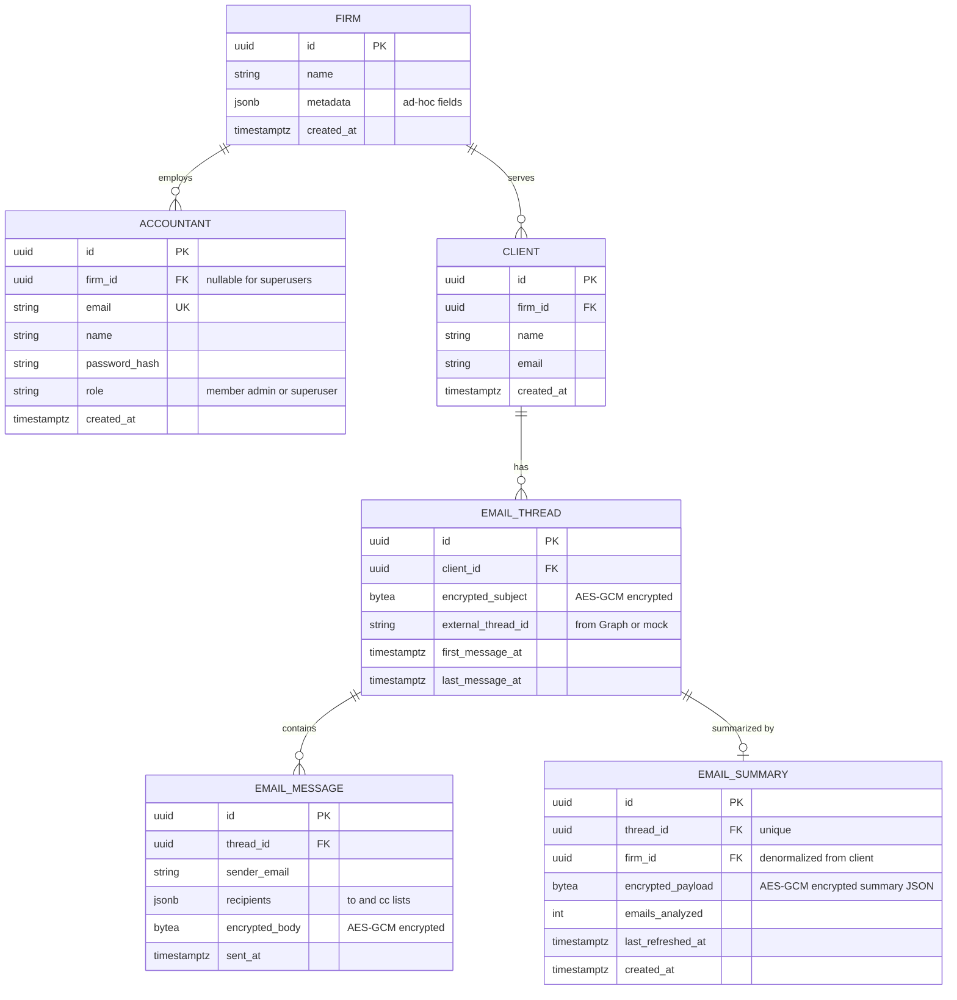

# Schema — Email Context System

## ER Diagram

## Key decisions

- **One firm per accountant / per client** — single nullable/non-null `firm_id` FK, no composite scoping.
- **AuthZ is firm-scoped, not per-client** — any accountant in a firm can read any client/thread within that firm. The AuthZ middleware extracts `firm_id` from the auth token and filters every query by it; no per-client assignment table is needed. If future requirements introduce per-client access control, reintroduce an `ACCOUNTANT_CLIENT` join table without touching the rest of the schema.
- **Summary per thread** — `EMAIL_SUMMARY.thread_id` is unique; refresh upserts in place.
- **Superusers** — modeled as a role on `ACCOUNTANT` with nullable `firm_id` (they're not tied to one firm). Could alternatively be a separate `superuser` table — flag for Q&A.
- **What's encrypted (AES-GCM at rest)** — `EMAIL_SUMMARY.encrypted_payload` (the summary JSON), `EMAIL_MESSAGE.encrypted_body`, and `EMAIL_THREAD.encrypted_subject`. Raw email content is at least as sensitive as the derived summary, so both are encrypted with the same scheme. Sender/recipient email addresses are left in cleartext because they're needed for filtering, actor extraction, and admin reports — they're protected by AuthZ + transport/disk encryption rather than column-level encryption. Worth flagging in Q&A if a stricter posture is required (e.g., deterministic encryption for searchable fields).
- **Assumption: no search on subject or body** — because subjects and bodies are encrypted with a non-deterministic scheme (random IV per row), `LIKE` / full-text search on those columns is impossible. Implications: (1) the UI can't offer "search threads by subject keyword" without decrypting every row server-side; (2) any keyword/search feature must run *after* summarization and target the (also-encrypted) summary, or use a separate searchable index (e.g., hashed keyword tokens) added later. Acceptable for this case study since search isn't in the requirements — flag in Q&A if it's expected.
- **`external_thread_id`** — lets us dedupe and re-import idempotently when the real Graph API replaces the mock service.

## Denormalization

A few deliberate denormalizations to optimize for the read patterns in the spec:

- **`EMAIL_SUMMARY.firm_id`** — duplicated from `EMAIL_SUMMARY → EMAIL_THREAD → CLIENT → FIRM`. Reasoning:
  - **Reports drive this.** Superuser report is "summaries grouped by firm"; admin report is "clients with summaries in *my* firm". Both currently need a 3-way join just to filter or group. With `firm_id` on the summary row, superuser becomes `SELECT firm_id, COUNT(*) FROM email_summary GROUP BY firm_id` — single table, single index scan. Admin becomes `WHERE firm_id = $1` — same.
  - **AuthZ is faster too.** Every summary read goes through `firm_id` check first; no join needed to enforce tenant boundaries.
  - **Cost is tiny.** 16 bytes per row, populated once at insert time from the thread's client. The denormalization is *safe* because `client.firm_id` is immutable in our model (a client doesn't move between firms). If that assumption ever changes, we'd need a backfill — flag for Q&A.
- **Already-denormalized fields worth pointing out:**
  - `EMAIL_THREAD.last_message_at` — duplicates `MAX(EMAIL_MESSAGE.sent_at)`. Lets "list a client's recent threads" be a simple `ORDER BY` instead of a per-thread aggregate.
  - `EMAIL_SUMMARY.emails_analyzed` — cached count rather than `COUNT(*)` over messages at read time.

### Candidates we didn't take, and why

- **`EMAIL_THREAD.firm_id`** — same logic as the summary, would skip a join in thread-list queries. Reasonable to add later; deferred because thread reads are already client-scoped (we usually have `client_id` in hand, which is already a single-FK hop to `firm_id`).
- **Counter columns on `FIRM`** (e.g., `summary_count`, `client_count`) — would make admin reports `O(1)`. Skipped because the reporting volume is unlikely to be hot, and counter columns add write-time complexity (triggers or transactional updates on every summary insert/delete). If reports become hot, **a materialized view** is the better next step — refresh nightly or on-demand.
- **Full pre-aggregated report tables** — over-engineered for current scale; revisit if the spec's "10x" scalability requirement turns into "100x".

The general principle I'm applying: denormalize when the *read pattern is well-known and frequent*, the *source field is immutable or rarely changes*, and the *write-time cost is one extra column assignment*. Avoid it when consistency is fragile or the read pattern is speculative.

## Indexes (beyond PKs/FKs)

- `ACCOUNTANT (firm_id)`, `CLIENT (firm_id)` — firm-scoped list queries.
- `EMAIL_THREAD (client_id, last_message_at DESC)` — list a client's threads newest-first.
- `EMAIL_THREAD (external_thread_id)` unique — idempotent imports.
- `EMAIL_MESSAGE (thread_id, sent_at)` — paginate a thread chronologically.
- `EMAIL_SUMMARY (thread_id)` unique — one summary per thread.
- `EMAIL_SUMMARY (firm_id)` — superuser/admin report aggregations.
